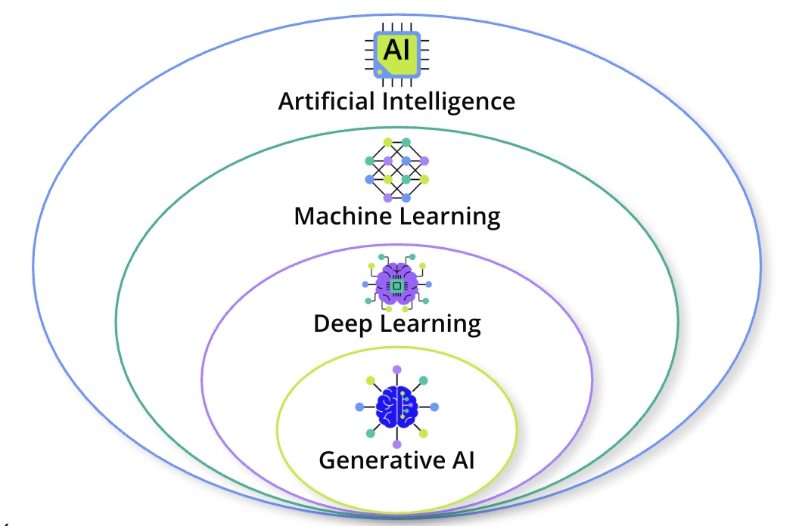

# Generative AI Overview

Welcome! This module dives into the exciting and rapidly evolving world of Generative AI. You've likely heard the buzz around tools like ChatGPT, seen AI-generated videos, and heard of voice cloning. Here, we'll move beyond the headlines to build a foundational understanding of this transformative technology, exploring what GenAI is and why it's capturing so much attention. Whether you're a curious learner or a professional looking to leverage AI, you're in the right place to start.

By the end of this module, you'll be able to:

- **Define** what Generative AI (GenAI) is at a foundational level.
- **Identify** common, real-world examples of GenAI, such as chatbots and media creation tools.
- **Explain** the importance of understanding this transformative technology.

## What is Generative AI?

Generative AI is a specialized field of artificial intelligence. Unlike traditional AI that analyzes or predicts, Generative AI focuses on creating entirely new and realistic content, such as text, images, or data, by learning from existing examples.

At its core, Generative AI is a specialized subset of artificial intelligence. Its primary focus is on creating new content or data that is both novel and realistic.

Unlike traditional AI, which might be used to analyze data or make predictions, generative models use existing data to generate completely new, unseen outputs. The goal is to build systems that learn the underlying patterns and structures from existing data, such as books, images, or artwork, and then use that understanding to produce something new.

This breakthrough allows AI to move beyond simply understanding or predicting. It transforms AI into a creative tool that adept users can leverage to innovate and create new works.

Generative AI fits into the broader field of AI as its newest subset. The hierarchy starts with **Artificial Intelligence (AI)**, the broad concept of machines mimicking human tasks like problem-solving or decision-making. Within AI is **Machine Learning (ML)**, which allows computers to improve at tasks without explicit programming. A subset of ML is **Deep Learning**, which uses artificial neural networks inspired by the human brain. Finally, **Generative AI** leans on deep learning to create its novel and realistic content, often guided by natural language.

# GenAI Capabilities and Concerns

Generative AI's impact is sweeping across multiple modalities, from text and code to images and audio. By mimicking human perception, these powerful models can create diverse content. However, their emergent capabilities, such as reasoning and tool use, also introduce significant ethical and societal challenges that we must navigate responsibly.

Generative AI's ability to create new content spans several key modalities.

**Text Generation** is one of the most familiar. Large Language Models (LLMs) can generate human-like text for chatbots, writing aids, and even full marketing campaigns. They excel at summarization, providing concise versions of long documents, and can perform sophisticated question-answering.

**Code Generation** has made Generative AI a developer's new best friend. It powers tools like GitHub Copilot and AI-powered IDEs, assisting with writing code, creating tests, generating commit messages, and producing documentation.

**Image and Video Generation** brings AI into the visual realm. These models can create original images and videos, powering photo editing tools, design ads, and even generate entire scenes from simple text prompts. For example, a tool like OpenAI's Sora can create short videos from a prompt like, "Robin Hood fighting tyranny in a 21st-century city."

**Audio Generation** extends beyond text and visuals. AI can compose music, generate speech, and even perform professional-quality voice cloning by fine-tuning on a sufficient amount of high-quality audio data.

The reach of Generative AI also extends to more specialized applications, such as drug discovery using genomic data, creating 3D models for architectural planning, and working with protein and DNA structures.

A fascinating aspect of large models is the concept of **emergent properties**. Due to their sheer scale, these models can perform tasks they weren't explicitly trained for, showcasing unexpected capabilities. It’s like teaching someone to read, and they suddenly start composing symphonies.

This leads to new, proactive capabilities:

- **Tool Use:** If an LLM is informed that it has access to a tool (like a calculator), it can decide to use that tool when needed to solve a problem. In practice, developers often ask the model to format its request to use a tool in a specific way, like a JSON object, for easy parsing.
- **Reasoning:** In the context of LLMs, reasoning means breaking down complex problems into smaller, sequential steps to arrive at a conclusion. Models can be encouraged through prompting and training to use this step-by-step approach, much like a human would solve a logic puzzle.

With great power comes great responsibility. Generative AI introduces significant ethical and societal considerations.

- **Bias and Fairness:** Models learn from their training data. If the data contains societal biases, the AI-generated content can reflect or even amplify those biases, leading to stereotypes or unfair representations. The principle of "garbage in, garbage out" applies.
- **Misinformation and Deepfakes:** The ability to produce highly realistic fake images, videos, or audio (deepfakes) raises serious concerns about the spread of misinformation.
- **Intellectual Property and Copyright:** Questions over ownership of AI-generated content are a hot debate. If models are trained on copyrighted web data, they may reproduce protected art styles, music, or code. The 2023 Hollywood writers' strike, for instance, heavily focused on ensuring writers were compensated for AI content based on their original works.
- **Privacy and Security:** Since LLMs are trained on massive datasets, there is a risk they could "regurgitate" private or sensitive information from their training data.
- **Environmental Impact:** Training these colossal models requires immense computational resources and consumes non-trivial amounts of electricity, raising concerns about their carbon footprint.
- **Labor Impacts:** The potential impact of AI on the labor market is a major concern.

## Will AI replace workers?

The discussion around AI's impact on employment is often framed around replacement. However, the history of technological advancement since the Industrial Revolution has largely been one of increased productivity. The story of Generative AI's impact is still being written, and we all play a role in determining whether it is used responsibly and how its benefits are distributed.

> Generative AI offers transformative capabilities across text, code, image, and audio, but its rapid advancement requires careful consideration of ethical issues like bias, misinformation, and its impact on labor.
